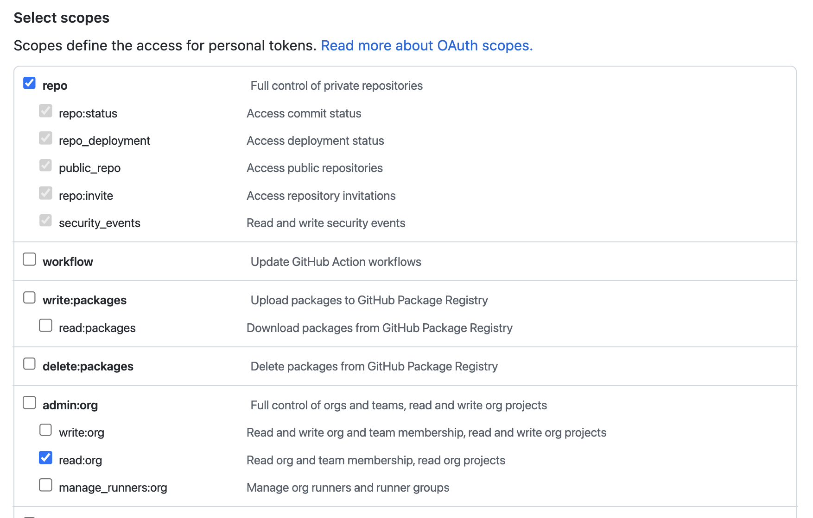

# A guide to making a release

This guide collects the steps we do in SetFit to make a release on PyPI. They result from hard-learned lessons (mostly on Transformers) and while following this guide is completely optional, it’s strongly recommended to do so. 🙂

### Preparation

To be able to make a release for a given project, you’ll need an account on [PyPI](https://pypi.org/) and on [Test PyPI](https://test.pypi.org/). If you are making a release for an existing project, your username will need to be added to that project by one of the current maintainers on PyPI. Note that we strongly recommend enabling two-factor authentication on PyPI.

You will also need to install twine in your Python environment with `pip install twine`.

## Minor or major releases

Follow this guide when you are release a new version of your package (not a patch). For patches go to the section on patch releases below.

### Step 1: Cut a release branch

This will ensure no one merges anything new in the upcoming release while you’re working on this. We recommend naming it `v{major}.{minor}-release` so you can reuse that same branch for patch releases.

You can create the branch and push it with

```bash
git checkout -b v{major}.{minor}-release
git push -u origin v{major}.{minor}-release
```

**Make sure you are at the right commit on the main branch before executing this and do not forget to pull the main branch if you want to branch from the last commit!**

### Step 2: Prepare the release notes

We have [a space](https://huggingface.co/spaces/lysandre/github-release) to help you with that. You will need a [GitHub token](https://docs.github.com/en/authentication/keeping-your-account-and-data-secure/creating-a-personal-access-token) with the following scopes:



Save the token somewhere safe, as GitHub does not let you see it again after it’s created. Next, adjust the settings of the Space to get the whole list of commits done since last release, along with the top contributors outside of the Hugging Face team.

You can then put your release notes in a Draft Release on GitHub, in [https://github.com/huggingface/setfit/releases](https://github.com/huggingface/setfit/releases) and write a small paragraph highlighting each of the new features this release is adding.

### Step 3: Adjust the version of your package

You should have the current version specified in the `[setup.py](setup.py)` and then the main `__init__.py` files. This version should be a dev version before you release, change it to the name of the version you are releasing by running:

```
make pre-release
```

Commit the changes on your release branch and push them:

```bash
git checkout v{major}.{minor}-release
git add setup.py src
git commit -m "Release: v{VERSION}"
git push -u origin v{major}.{minor}-release
```

### Step 4: Make sure all tests pass

Your CI should run on the release branch (if it doesn’t, you should make it do that 😅). Make sure all tests are green before proceeding to the next step.

### Step 5: Add a tag for your release

A tag will flag the exact commit associated to your release (and be easier to remember than the commit hash!). The tag should be `v<VERSION>` so for instance `v4.12.0` . This is important for the documentation.

Here is how you can create and push your tag:

```bash
git tag v<VERSION> -m 'Adds tag v<VERSION> for PyPI'
git push --tags origin v{major}.{minor}-release
```

### Step 6: Create the wheels for your release

This is what you'll upload on PyPI and what everyone will download each time they `pip install` your package.

Clean previous builds by running:

```
make wheels_clean
```

Then run:

```bash
make wheels
```

This will create two folders, `build` and a `dist` with the new versions of your package.

### Step 7: Upload your package on PyPI test

**DO NOT SKIP THIS STEP!**

This is the most important check before actually releasing your package in the wild. Upload the package on PyPI test and check you can properly install it.

To upload it:

```bash
make pypi_test_upload
```

You will be prompted for your username and password.

Then in a fresh environment containing all dependencies you need, try to install your new package from the PyPI test server.

```bash
make pypi_test_install
```

If everything works, you should get the following message:

```
🚀 Successfully installed setfit from test.pypi.org
```

### Step 8: Publish on PyPI

This cannot be undone if you messed up, so make sure you have run Step 7!

Once you’re fully ready, upload your package on PyPI:

```bash
make pypi_upload
```

You will be prompted for your username and password, unless you're using the recommended [PyPI API token](https://pypi.org/help/#apitoken).

### Step 9: Publish your release notes

Go back to the draft you did at step 2 ([https://github.com/huggingface/setfit/releases](https://github.com/huggingface/setfit/releases)) and add the tag you created at step 4 to your release before publishing your release notes.

### Step 10: Bump the dev version on the main branch

You’re almost done! Just go back to the `main` branch and change the dev version in the `setup.py` and the main `__init__.py` to the new version you’re developing, for instance `4.13.0.dev0` if just released `4.12.0`.

### Patch releases

Follow this guide when you are releasing a patch to fix a bug introduced in a release. For minor or major releases go [here](#minor-or-major-releases).

### Step 1: Go on the last release branch and cherry-pick the commit

If you followed this guide, you should have a branch `v{major}.{minor}-release` that you used for the last release. If you did not, you will need to create it know from the tag of the last release.

Checkout that release branch:

```bash
git checkout v{major}.{minor}-release
```

Then cherry-pick the commit fixing the bug for which you are making the patch release. You will need to find its commit hash.

```bash
git cherry-pick {commit_hash}
git push -u origin v{major}.{minor}-release
```

### Step 2: Adjust the version of your package

You should have the current version specified in the `[setup.py](setup.py)` and then the main `__init__.py` files. This should be a bump in the micro version (so go from `4.12.0` to `4.12.1` for instance). There is a utility to do this step with `make pre-patch`.

Commit the changes on your release branch and push them:

```bash
git checkout v{major}.{minor}-release
git add setup.py src
git commit -m "Release: v{VERSION}"
git push -u origin v{major}.{minor}-release
```

### Step 3: Make sure all tests pass

Your CI should run on the release branch (if it doesn’t, you should make it do that 😅). Make sure all tests are green before proceeding to the next step.

### Step 4: Add a tag for your release

A tag will flag the exact commit associated to your release (and be easier to remember than the commit hash!). The tag should be `v<VERSION>` so for instance `v4.12.1` . This is important for the documentation.

Here is how you can create and push your tag:

```bash
git tag v<VERSION> -m 'Adds tag v<VERSION> for pypi'
git push --tags origin v{major}.{minor}-release
```

### Step 5: Create the wheels for your release

This is what you'll upload on PyPI and what everyone will download each time they `pip install` your package.

Clean previous builds by running:

```
make wheels_clean
```

Then run:

```bash
make wheels
```

This will create two folders, `build` and a `dist` with the new versions of your package.

### Step 6: Upload your package on PyPI test

**DO NOT SKIP THIS STEP!**

This is the most important check before actually releasing your package in the wild. Upload the package on PyPI test and check you can properly install it.

To upload it:

```bash
make pypi_test_upload
```

You will be prompted for your username and password.

Then in a fresh environment containing all dependencies you need, try to install your new package from the PyPI test server.

```bash
make pypi_test_install
```

If everything works, you should get the following message:

```
🚀 Successfully installed setfit from test.pypi.org
```

Also make sure the bug you are fixing is actually fixed by running any reproducer of the bug.

### Step 7: Publish on PyPI

This cannot be undone if you messed up, so make sure you have run Step 7!

Once you’re fully ready, upload your package on PyPI:

```bash
make pypi_upload
```

You will be prompted for your username and password, unless you're using the recommended [PyPI API token](https://pypi.org/help/#apitoken).

### Step 8: Publish your release notes

Go to your GitHub release pages ([https://github.com/huggingface/setfit/releases](https://github.com/huggingface/setfit/releases)) and write a quick explanation of what the patch fixes. Include the tag you added at step 4 and you are good to publish!