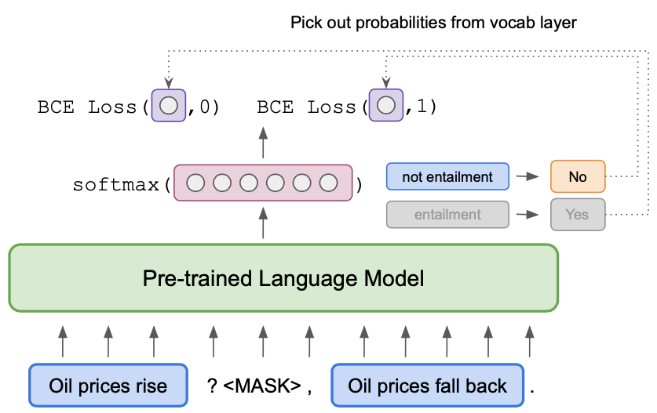
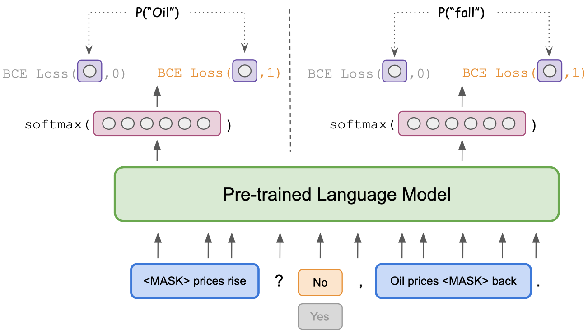

# ADAPET for SetFit #

Our results were created in Python 3.6.8 with a 40 GB NVIDIA A100 Tensor Core GPU

To setup, please follow the instructions below.
````
python3.6 -m venv venv
source mvenv/bin/activate
pip install -r requirements.txt
pip install torch==1.9.0+cu111 -f https://download.pytorch.org/whl/torch_stable.html
````


To run ADAPET on SetFit datasets, specify the dataset and PLM as argument to python. Additionally, if you wish to
run on a multilingual dataset, then you can choose to prompt/verbalize in the English or the language in question.
You can also remove the prompt.

For example, if you wish to run ADAPET on `sst2` with a prompt and with `albert-xxlarge-v2` as the PLM, simply run the following
```
python setfit_adapet.py --pretrained_weight="albert-xxlarge-v2"\
                --english=True\
                --prompt=True\
                --task_name='SetFit/sst2'\
```

If you wish to run ADAPET on amazon_reviews_multi_ja, prompt in Japanese, with mdeberta-base
```
python setfit_adapet.py --pretrained_weight="microsoft/mdeberta-v3-base"\
                --english=False\
                --prompt=True\
                --task_name='SetFit/amazon_reviews_multi_ja'\
```

This will hopefully run ADAPET and evaluate it on the test set for the 8 and 64 splits.

In the multilingual case, ADAPET runs in the "each" scenario as described in the paper by default. You can change this by adding a multilingual argument, such as

```
python setfit_adapet.py --pretrained_weight="microsoft/mdeberta-v3-base"\
                --english=False\
                --prompt=True\
                --task_name='SetFit/amazon_reviews_multi_ja'\
                --multilingual='all'\
```


Note that with default hyperparameters this will take a very long time. If you change to distilbert-base-uncase or another smaller model, ADAPET will be much faster.

Once ADAPET is done, the results will be written as follows
```
seed_output / model_name / dataset_name / train-{num_samples}-{split_dx} / results.json
```
 
For non-English datasets, the plm may have different endings. The ending describes the prompting situation:
````
{plm}__eng_prompt == prompt and verbalize in english
{plm}__lang_prompt == prompt and verbalize in the language in question.
{plm}__lang_no-prompt == take the prompt away and verbalize in the language in question
{plm}__eng_no-prompt == take the prompt away and verbalize english
````

# ADAPET #

This repository contains the official code for the paper: "[Improving and Simplifying Pattern Exploiting Training](https://arxiv.org/abs/2103.11955)".

The model improves and simplifies [PET](https://arxiv.org/abs/2009.07118) with a decoupled label objective and label-conditioned MLM objective. 


## Model ## 

 
                       **Decoupled Label Loss                                                Label Conditioned Masked Language Modelling**

## Updates ##

- [November 2021] You can run ADAPET on your own dataset now! See instructions [here](#train-your-own-adapet)

## Setup ##

Setup environment by running `source bin/init.sh`. This will 

- Download the [FewGLUE](https://github.com/timoschick/fewglue) and [SuperGLUE](https://super.gluebenchmark.com/tasks) datasets in `data/fewglue/{task}` and `data/superglue/{task}` respectively. 
- Install and setup environment with correct dependencies.

## Training  ##

First, create a config JSON file with the necessary hyperparameters. For reference, please see `config/BoolQ.json`.

Then, to train the model, run the following commands:
```
sh bin/setup.sh
sh bin/train.sh {config_file}
```

The output will be in the experiment directory `exp_out/fewglue/{task_name}/albert-xxlarge-v2/{timestamp}/`. Once the model has been trained, the following files can be found in the directory:
```
exp_out/fewglue/{task_name}/albert-xxlarge-v2/{timestamp}/
    |
    |__ best_model.pt
    |__ dev_scores.json
    |__ config.json
    |__ dev_logits.npy
    |__ src
```

To aid reproducibility, we provide the JSON files to replicate the paper's results at `config/{task_name}.json`.

## Evaluation ## 

To evaluate the model on the SuperGLUE dev set, run the following command:
```
sh bin/dev.sh exp_out/fewglue/{task_name}/albert-xxlarge-v2/{timestamp}/
```
The dev scores can be found in `exp_out/fewglue/{task_name}/albert-xxlarge-v2/{timestamp}/dev_scores.json`.


To evaluate the model on the SuperGLUE test set, run the following command.
```
sh bin/test.sh exp_out/fewglue/{task_name}/albert-xxlarge-v2/{timestamp}/
```
The generated predictions can be found in `exp_out/fewglue/{task_name}/albert-xxlarge-v2/{timestamp}/test.json`.

## Train your own ADAPET

- Setup your dataset in the data folder as
```
data/{dataset_name}/
    |
    |__ train.jsonl
    |__ val.jsonl
    |__ test.jsonl
```
Each jsonl file consists of lines of dictionaries. Each dictionaries should have the following format:
```
{
    "TEXT1": (insert text), 
    "TEXT2": (insert text), 
    "TEXT3": (insert text), 
    ..., 
    "TEXTN": (insert text), 
    "LBL": (insert label)
}
```
- Run the experiment
```
python cli.py --data_dir data/{dataset_name} \
              --pattern '(INSERT PATTERN)' \
              --dict_verbalizer '{"lbl_1": "verbalizer_1", "lbl_2": "verbalizer_2"}'
```
Here, `INSERT PATTERN` consists of `[TEXT1]`, `[TEXT2]`, `[TEXT3]`, ..., `[LBL]`.
For example, if the new dataset had two text inputs and one label, a sample pattern would be `[TEXT1] and [TEXT2] imply [LBL]`.

## Fine-tuned Models ##

Our fine-tuned models can be found in this [link](https://drive.google.com/drive/folders/1pdVHI1Z6eRGs8OMklDCwXkPFK731yc_P?usp=sharing).

To evaluate these fine-tuned models for different tasks, run the following command:
```
python src/run_pretrained.py -m {finetuned_model_dir}/{task_name} -c config/{task_name}.json -k pattern={best_pattern_for_task}
```
The scores can be found in `exp_out/fewglue/{task_name}/albert-xxlarge-v2/{timestamp}/dev_scores.json`.
**Note**: The `best_pattern_for_task` can be found in Table 4 of the paper.

## Contact ##

For any doubts or questions regarding the work, please contact Derek ([dtredsox@cs.unc.edu](mailto:dtredsox+adapet@cs.unc.edu)) or Rakesh ([rrmenon@cs.unc.edu](mailto:rrmenon+adapet@cs.unc.edu)). For any bug or issues with the code, feel free to open a GitHub issue or pull request.

## Citation ##

Please cite us if ADAPET is useful in your work:

```
@inproceedings{tam2021improving,
          title={Improving and Simplifying Pattern Exploiting Training},
          author={Tam, Derek and Menon, Rakesh R and Bansal, Mohit and Srivastava, Shashank and Raffel, Colin},
          journal={Empirical Methods in Natural Language Processing (EMNLP)},
          year={2021}
}
```
